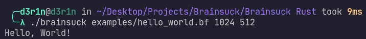
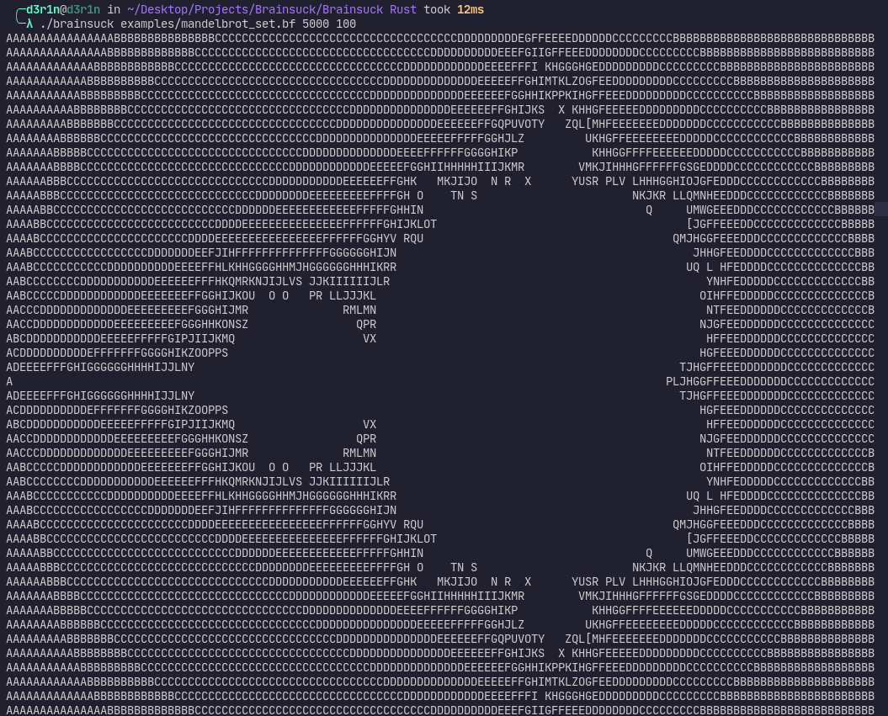
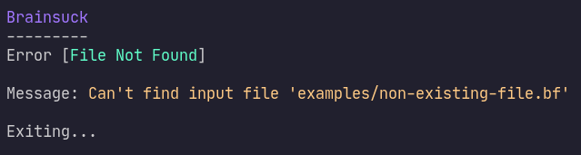
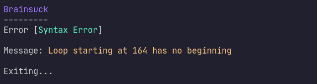
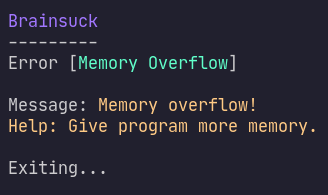
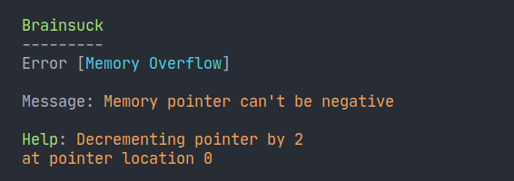

<div align="center">
	<h1>Brainsuck</h1>
	Brainfuck but not really... like... a better version of it.
</div>

<h1>Installation</h1>

<h2>Pre-build</h2>

Pre-build binaries can be found in [releases](https://github.com/d3r1n/brainsuck/releases/)

<h2>Manual</h2>

Requirements:

- Rust version 1.50 or higher

<h3>Linux</h3>

```bash
curl https://raw.githubusercontent.com/d3r1n/brainsuck/master/install.sh | bash
```

<h3>Windows</h3>

- Clone the repository and cd into it
- run `cargo build --release`
- generated binary will be in `target/release` (binary name: bs_bin)

<h2>Usage:</h2>

<h3>Help</h3>

```bash
$ brainsuck [-h, --help]
```

<h3>Interactive Shell</h3>

```bash
$ brainsuck
```

<h3>Execute</h3>

```bash
$ brainsuck <INPUT FILE> [OPTIONS]
```

<h4>Options</h4>

- **[-m, --mem-size]:** Sets the program's memory size. 			(default: 1024)
- **[-p, --ptr-loc]:** Sets the program's memory pointer location. 	(default: 512)
- **[-a, --auto]:** Automatically allocates memory for the program. (default: false)
- **[-o, --optimize]:** Optimize the Parser and Interpreter 		(default: 1024)

<h2>Versions History</h2>

- **v3.0** *[Next]*
	* Adding more functionality and more keywords (Main Feature)
	* Adding a compiler based on LLVM (Main Feature)
	* Adding a transpiler to C and Rust (Main Feature)
	* Adding JiT compilation (Main Feature)
- **v2.5** *[Now]*
	* Optimized the Parser and Interpreter (Main Feature)
	* Improved speed (3x-100x times faster optimized) (Main Feature)
	* Bug fixes
- **v2.0** *[Previous]*
	* Added **Interactive Shell** (Main Feature) `see Usage ^`
	* More bug fixes
- **v1.5**
	* Automatic Memory Allocation (Main Feature)
	* New way of argument handling
	* Some bug fixes
- **v1.0**
	* Initial Verison of Brainsuck

<h2>Some screenshots:</h2>

<h3>Programs:</h3>

---

<h3>Hello, World!</h3>


<h3>Mandelbrot Set</h3>

<details>

<summary>Click to expand</summary>


</details>

<h3>Errors</h3>

---

<h3>File Not Found</h3>


<h3>Syntax Errors</h3>


<h3>Memory Overflow Errors</h3>



---

<h2>TODO:</h2>

- [X]   Add basic brainfuck commands.
- [X]   Add automatic memory allocation.
- [X]	Add repl
- [ ]   Add optimization
- [ ]   Add custom keywords
- [ ]   Add macros
- [ ]   Add a compiler
- [ ]   Add a JiT compiler

---

<h2>Mentions:</h2>

> [SpongeBed81](https://github.com/SpongeBed81) with his language [Yearlight](https://github.com/SpongeBed81/yearlight)
